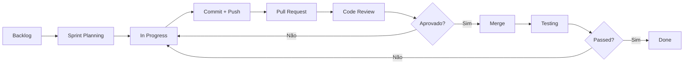

# Processo de Desenvolvimento

O desenvolvimento da AIDE segue uma metodologia baseada em **Sprints**, utilizando a plataforma **Jira** como ferramenta de gestão de projetos e o **GitHub** para controlo de versões e colaboração de código.

---

## Metodologia Ágil

### **Sprints**
O projeto é desenvolvido em ciclos iterativos chamados sprints, permitindo entregas incrementais e feedback contínuo.

- **Duração**: Cada sprint tem uma duração definida pela equipa
- **Planeamento**: No início de cada sprint, a equipa seleciona as tarefas prioritárias do backlog
- **Daily Standups**: Reuniões curtas para sincronização diária da equipa
- **Retrospetivas**: Análise do sprint anterior para melhoria contínua

---

## Gestão de Projetos com Jira

### **Organização do Backlog**
O Jira é utilizado para gerir todo o ciclo de vida das tarefas:

- **Epics**: Grandes funcionalidades divididas em histórias menores
- **User Stories**: Descrições de funcionalidades do ponto de vista do utilizador
- **Tasks**: Tarefas técnicas específicas
- **Bugs**: Registo e acompanhamento de problemas

### **Workflow de Tarefas**
Cada tarefa passa pelos seguintes estados:

| Estado | Descrição |
|--------|-----------|
| **To Do** | Tarefa no backlog, pronta para ser iniciada |
| **In Progress** | Trabalho em desenvolvimento ativo |
| **Code Review** | Código submetido e a aguardar revisão |
| **Testing** | Em fase de testes e validação |
| **Done** | Tarefa concluída e validada |

### **Priorização**
As tarefas são priorizadas com base em:
- Valor para o utilizador
- Dependências técnicas
- Complexidade de implementação
- Prazos do projeto

---

## Integração com GitHub

### **Ligação Jira-GitHub**
A integração entre o Jira e o GitHub permite:

- **Rastreabilidade**: Commits e PRs associados automaticamente às tarefas
- **Atualizações automáticas**: O estado das tarefas é atualizado com base na atividade do GitHub
- **Visibilidade**: Links diretos entre issues do Jira e código no GitHub

### **Convenções de Commits**
Para manter a ligação entre código e tarefas, seguimos convenções:

```
<tipo>(<âmbito>): <descrição> [AIDE-XXX]
```

**Tipos de commits:**
- `feat`: Nova funcionalidade
- `fix`: Correção de bug
- `docs`: Alterações na documentação
- `style`: Formatação de código
- `refactor`: Reestruturação sem alterar funcionalidade
- `test`: Adição ou correção de testes
- `chore`: Manutenção e tarefas auxiliares

**Exemplo:**
```
feat(auth): implementar login com biometria [AIDE-123]
```

### **Branching Strategy**
Utilizamos uma estratégia de branches para organizar o desenvolvimento:

```
main
├── develop
│   ├── feature/AIDE-123-login-biometrico
│   ├── feature/AIDE-124-dashboard-widgets
│   └── fix/AIDE-125-corrigir-navegacao
└── release/v1.0.0
```

- **main**: Código em produção, sempre estável
- **develop**: Branch de integração para novas funcionalidades
- **feature/**: Branches para desenvolvimento de novas funcionalidades
- **fix/**: Branches para correção de bugs
- **release/**: Preparação de novas versões

### **Pull Requests**
Todas as alterações passam por revisão de código:

1. Criar PR com descrição clara do que foi alterado
2. Associar a tarefa do Jira correspondente
3. Aguardar revisão de pelo menos um membro da equipa
4. Resolver comentários e sugestões
5. Merge após aprovação

---

## Fluxo de Trabalho Completo



---

## Boas Práticas

### **Desenvolvimento**
- Manter commits pequenos e focados
- Escrever mensagens de commit descritivas
- Atualizar o status das tarefas no Jira regularmente
- Documentar decisões técnicas importantes

### **Colaboração**
- Comunicar bloqueios imediatamente
- Participar ativamente nas reuniões de equipa
- Dar feedback construtivo nas revisões de código
- Partilhar conhecimento com a equipa

### **Qualidade**
- Escrever testes para novas funcionalidades
- Manter a cobertura de código acima do mínimo definido
- Resolver warnings e erros de linting antes do commit
- Seguir os padrões de código estabelecidos

---

:::tip Dica
Utilize a extensão do Jira no VS Code para gerir tarefas diretamente no editor, aumentando a produtividade e mantendo o foco no código.
:::
